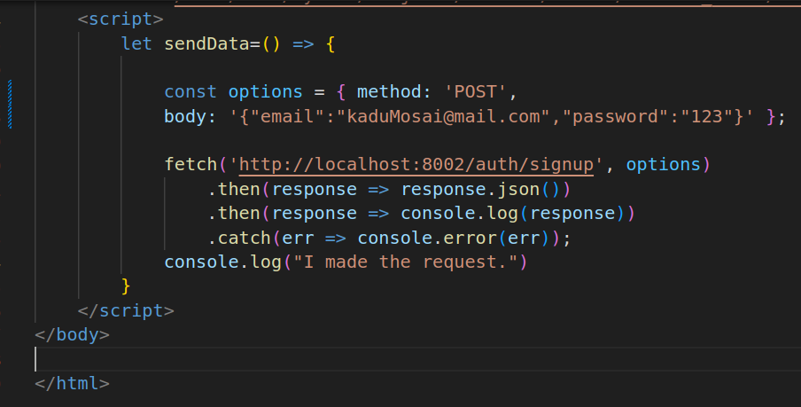
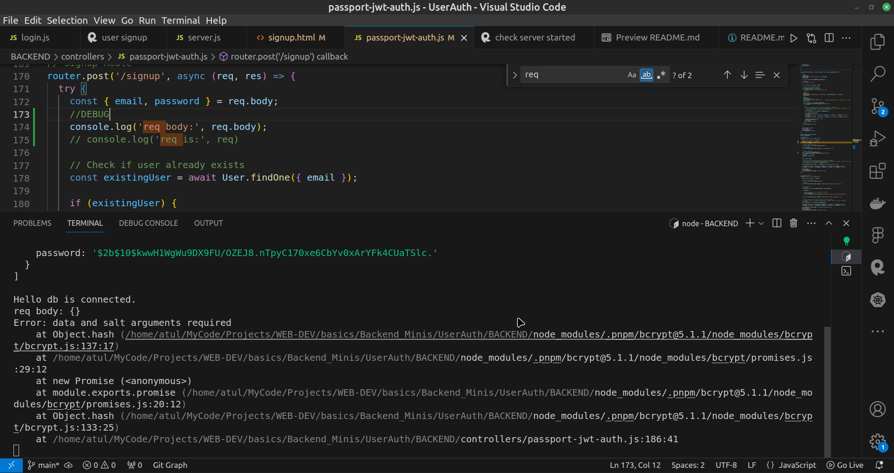
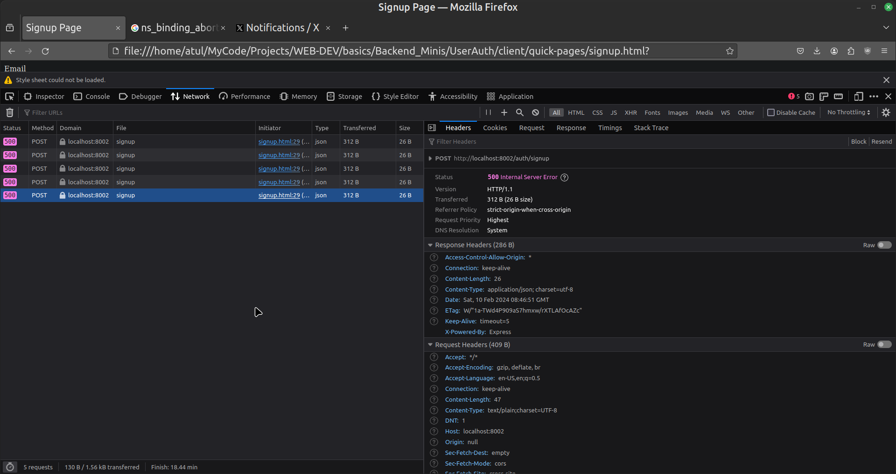

# Headers

***💡️ Note I am not writing this in a formal way***

I will be telling you the importance of headers and how I came to acknowledge it.

## Problems I encountered

I started doing this project which is auth related backend code.  
So when I was done with writing the code.  
I wanted to test my endpoints. It worked fine on Rapid API client.  

I was happy but then I started to test the same code in browser.  
But it failed. I was confused.

After taking some help. I was told passing headers is important.

Although It worked without **header** with node but not with browser.

Here is the sample



It resulted in 



Here's what the browser said.



But this code ran normally from the node.

```JS
const options = {method: 'POST', body: '{"email":"kaduMosai@mail.com","password":"123"}'};

fetch('http://localhost:8002/auth/signup', options)
  .then(response => response.json())
  .then(response => console.log(response))
  .catch(err => console.error(err));
```

But then I added the headers and it worked from browser as well.  
A big thanks to [Haroon](https://github.com/iHaroon29) for telling me about headers.

```JS
const options = {method: 'POST', headers: {'Content-type':'application/json'}, body: '{"email":"kaduMosai@mail.com","password":"123"}'};

fetch('http://localhost:8002/auth/signup', options)
  .then(response => response.json())
  .then(response => console.log(response))
  .catch(err => console.error(err));
```
